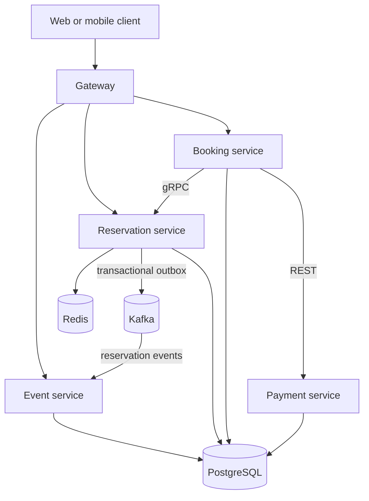

# SeatSync

SeatSync is a clean-room, event-driven ticket reservation platform for high-demand event openings. Its central invariant is simple: **a seat can be sold at most once**, even when concurrent requests, retries, delayed payments, or expired holds occur at the same time.

The repository is intentionally production-oriented without pretending to be a production deployment. It includes correctness boundaries, failure handling, observability hooks, manual verification guidance, and load-test scenarios. Performance numbers belong in documentation only after they have been reproduced on a stated environment.

## Architecture



| Service | Responsibility |
| --- | --- |
| `gateway-service` | Routing, request correlation, JWT resource-server integration, and Redis-backed admission control |
| `event-service` | Events, venues, sections, and seat-map read APIs |
| `reservation-service` | Atomic expiring holds, authoritative seat state, expiration, and confirmation |
| `booking-service` | Idempotent checkout orchestration and compensating actions |
| `payment-service` | Deterministic payment-provider simulator with success, decline, timeout, and duplicate request modes |

### How one booking works

1. The client calls the gateway, which applies request correlation, rate limiting, and production JWT authentication.
2. The reservation service creates a temporary seat hold. Redis is the fast contention gate; PostgreSQL decides the durable winner.
3. The reservation transaction writes an outbox row. A background publisher sends that change to Kafka, and the event service updates its read model.
4. The booking service asks the payment service to authorize the simulated payment.
5. After authorization, booking calls reservation over gRPC to confirm the hold.
6. If confirmation fails, booking records `REFUND_PENDING` and retries the compensating refund. If the payment result is unclear, it records `PAYMENT_UNKNOWN` and reconciles it in the background.

The main code path is deliberately direct: controllers validate HTTP input, services contain business decisions, repositories persist state, and scheduled workers retry unfinished background work.

## Correctness model

PostgreSQL is the source of truth. Redis is a fast admission gate and TTL index; it is never the final authority for ownership.

1. A compare-and-set Redis script rejects obvious contention cheaply.
2. A conditional PostgreSQL update changes `AVAILABLE` to `HELD`. Only one transaction can update the row.
3. A unique active-hold constraint provides a second database boundary.
4. If the database transaction fails, ownership-scoped Redis cleanup removes only the caller's token.
5. Confirmation requires the original hold token and an unexpired database record.
6. The expiration worker locks due holds, releases seat state, and emits an outbox event in the same transaction.
7. Booking and payment endpoints require idempotency keys; replays return the original result.

See [the invariants](docs/INVARIANTS.md) and [architecture decisions](docs/adr/0001-reservation-consistency.md).

## Technology

Java 21, Spring Boot, PostgreSQL, Redis, Kafka, REST/OpenAPI, gRPC/Protocol Buffers, Flyway, transactional outbox, Prometheus, Docker Compose, and k6.

## Run locally

The complete local stack requires Java 21, Maven 3.9+, and a compatible container runtime with Compose.

```bash
docker compose up -d postgres redis kafka
mvn clean package -DskipTests
mvn -pl event-service spring-boot:run
mvn -pl reservation-service spring-boot:run
mvn -pl payment-service spring-boot:run
mvn -pl booking-service spring-boot:run
mvn -pl gateway-service spring-boot:run
```

Docker Desktop is not required to compile or statically verify the repository:

```bash
mvn clean package -DskipTests
```

On a machine where containers are restricted, point each service at externally managed PostgreSQL, Redis, and Kafka instances through the environment variables shown in `compose.yml`. The GitHub Actions workflows provide container-build and opt-in contention verification on hosted runners.

The gateway listens on `http://localhost:8080`. In the default development profile it permits requests; the `prod` profile enables JWT validation. HTTP application services expose OpenAPI documents through `/swagger-ui.html`.

The event service consumes reservation events from Kafka and updates its seat-map read model idempotently. Clients obtain current availability through the event service's REST API.

### Hold a seat

```bash
curl -X POST http://localhost:8080/api/reservations/holds \
  -H 'Content-Type: application/json' \
  -H 'Idempotency-Key: demo-hold-1' \
  -d '{"eventId":"10000000-0000-0000-0000-000000000001","seatId":"20000000-0000-0000-0000-000000000001","customerId":"30000000-0000-0000-0000-000000000001"}'
```

### Confirm a booking

```bash
curl -X POST http://localhost:8080/api/bookings \
  -H 'Content-Type: application/json' \
  -H 'Idempotency-Key: demo-booking-1' \
  -d '{"holdId":"<hold-id>","customerId":"30000000-0000-0000-0000-000000000001","amountMinor":499900,"currency":"INR","paymentMethodToken":"pm_success"}'
```

## Verification

```bash
mvn clean package -DskipTests
docker compose --profile observability up -d
k6 run --summary-export=load-tests/results/contention.json load-tests/contention.js
```

The k6 contention benchmark submits concurrent hold attempts for one seat and requires exactly one winner. See [the benchmark instructions](load-tests/README.md). No performance result is claimed until this workload has been run and its result retained.

### Run without Docker on your laptop

After pushing the repository to GitHub, open **Actions → cloud contention benchmark → Run workflow**. Choose a concurrency level and start the workflow. GitHub builds the reservation stack on a hosted Linux runner, executes k6, and provides the JSON result under the workflow's **Artifacts** section. No project process runs on the local computer.

## Repository guide

- `docs/` — invariants, API lifecycle, ADRs, and operational notes
- `infra/` — database bootstrap and Prometheus configuration
- `load-tests/` — reproducible high-contention workload
- `.github/workflows/` — Maven compilation and container-build checks

For a first code reading, follow these classes in order:

1. `ReservationController` → `ReservationService` → `RedisSeatGate` and `SeatInventoryRepository`
2. `OutboxPublisher` → `ReservationEventProjector`
3. `BookingController` → `BookingStore` → `BookingOrchestrator`
4. `PaymentController` → `PaymentService`

Review [operations](docs/OPERATIONS.md) and [security boundaries](SECURITY.md) before deploying beyond local development.

## License

MIT
