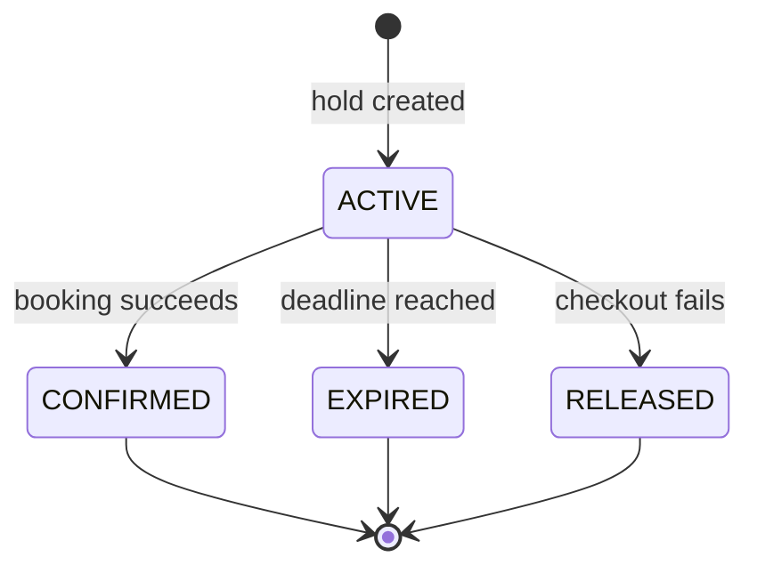
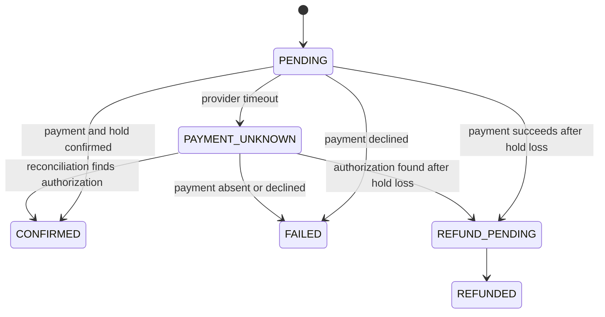

# System invariants

These statements define correctness. A feature is incomplete if it violates one of them.

1. A seat has at most one active hold.
2. A seat has at most one confirmed booking.
3. A hold may be confirmed only by the customer that owns it.
4. An expired, released, or already confirmed hold cannot be confirmed again.
5. Repeating a command with the same idempotency key and payload returns the original outcome.
6. Reusing an idempotency key with a different payload is rejected.
7. Every committed state transition that other services must observe creates an outbox record in the same database transaction.
8. Consumers may receive an event more than once and must process it idempotently.
9. Redis may reject or accelerate work but cannot make an unavailable seat available in PostgreSQL.
10. A delayed payment success cannot confirm an expired reservation; it initiates a refund instead.

## State machines

